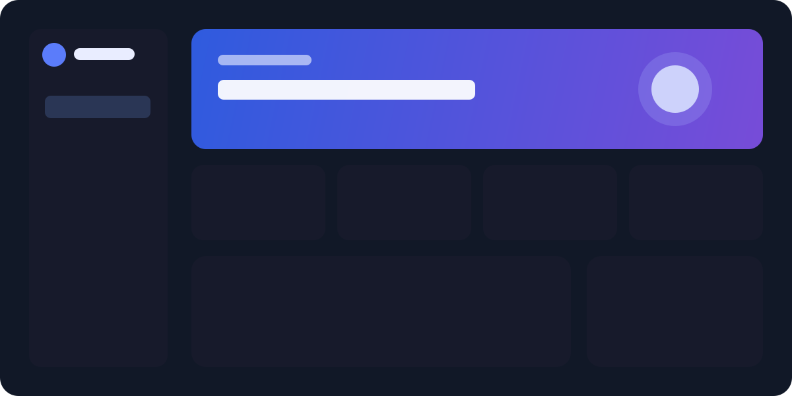

# AI Helpdesk

<p align="center">A polished, self-hosted customer support dashboard powered by FastAPI, SQLite, and the OpenAI API.</p>

<p align="center"><a href="#quick-start">Quick start</a> · <a href="#api">API</a> · <a href="#development">Development</a></p>



## Overview

AI Helpdesk is a compact, production-minded portfolio project for teams that want a clean support experience without a heavy frontend stack. It provides a premium dark dashboard, a persistent AI chat, and a documented REST API.

## Features

- Responsive premium SaaS dashboard built with vanilla HTML, CSS, and JavaScript.
- Conversation history persisted locally in SQLite.
- OpenAI-powered replies using the official Python SDK and Responses API.
- Friendly validation and error messages when input, connectivity, or configuration needs attention.
- New conversations, health checks, Swagger documentation, Docker Compose, and API tests.

## Tech stack

| Area | Technology |
| --- | --- |
| API | Python, FastAPI, Uvicorn |
| AI | Official OpenAI Python SDK, Responses API |
| Data | SQLite |
| Frontend | HTML, CSS, JavaScript |
| Testing | Pytest, FastAPI TestClient |
| Delivery | Docker, Docker Compose |

## Project structure

```text
.
├── backend/             # FastAPI routes, OpenAI service, SQLite access
├── frontend/            # Responsive dashboard UI
├── tests/               # API tests
├── docs/                # Architecture notes and visual assets
├── .env.example         # Safe environment-variable template
├── Dockerfile
├── docker-compose.yml
└── requirements.txt
```

## Quick start

### Docker

```bash
cp .env.example .env
# Add your OpenAI API key to .env
docker compose up --build
```

Open [http://localhost:8000](http://localhost:8000). API docs are available at [http://localhost:8000/docs](http://localhost:8000/docs).

### Local development

```bash
python -m venv venv
# Windows PowerShell
venv\Scripts\Activate.ps1
pip install -r requirements.txt
copy .env.example .env
uvicorn backend.main:app --reload
```

## Environment configuration

Create `.env` from `.env.example` and add a key created in your OpenAI account:

```env
OPENAI_API_KEY=your_openai_api_key_here
OPENAI_MODEL=gpt-4o-mini
```

The server reads credentials only from environment variables. If the key is missing, `/api/chat` returns a clear `503` response while the dashboard and health endpoint remain available. The implementation follows the official OpenAI Python SDK pattern for `client.responses.create`; see the [OpenAI API quickstart](https://developers.openai.com/api/docs/quickstart).

## API

### `GET /health`

```json
{ "status": "ok" }
```

### `POST /api/chat`

```bash
curl -X POST http://localhost:8000/api/chat \
  -H "Content-Type: application/json" \
  -d '{"message":"How do I update my billing details?"}'
```

```json
{
  "conversation_id": "b7a23c69-5531-4bdf-9ece-1bb71fb20e1c",
  "reply": "..."
}
```

`POST /api/conversations` creates an empty conversation. `GET /api/dashboard` returns lightweight local dashboard metrics. Explore all routes at `/docs`.

## Development

```bash
pytest
```

The SQLite database is created automatically at `data/helpdesk.db`. It is intentionally excluded from Git.

## Security

- Never commit `.env` or a real API key.
- `.env.example` contains placeholders only.
- The API key stays on the server; the browser never receives it.
- OpenAI requests use `store=False`, and the application keeps local conversation history in SQLite.

## Future improvements

- Authentication and workspace-level authorization.
- Streaming responses and agent handoff rules.
- Knowledge-base retrieval with citations.
- Conversation list, filtering, and export.
- Observability, rate limiting, and deployment automation.

## License

Distributed under the [MIT License](LICENSE).
