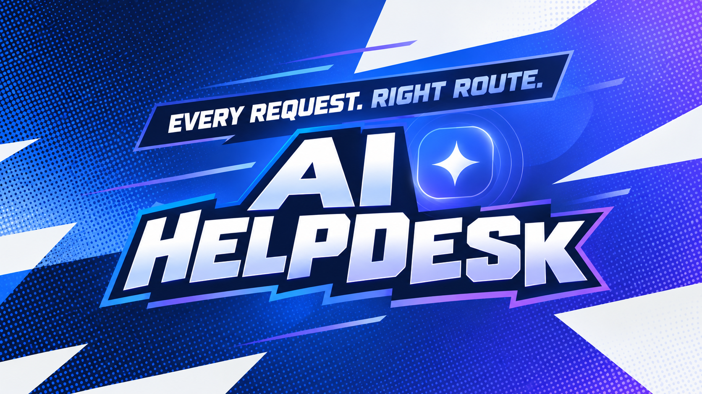
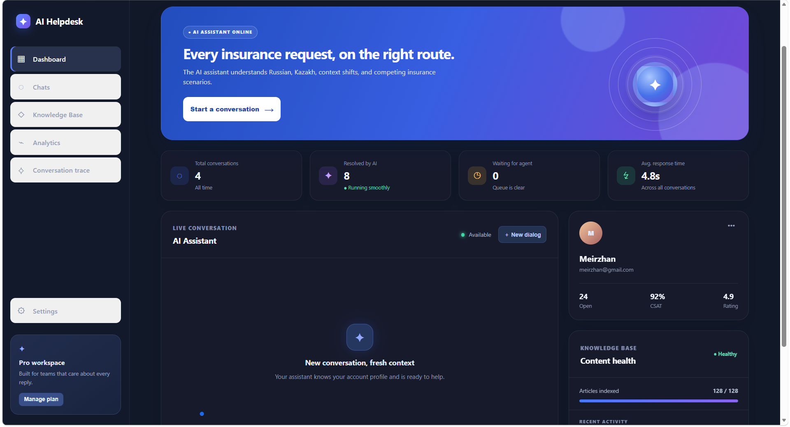

# AI Helpdesk

<p align="center">
  <strong>Голосовой AI-помощник для страховой поддержки</strong><br>
  Клиент говорит или пишет так, как ему удобно, а ассистент помогает быстро понять вопрос и следующий шаг.
</p>

<p align="center">
  <a href="#что-это">Что это</a> ·
  <a href="#как-пользоваться">Как пользоваться</a> ·
  <a href="#интерфейс">Интерфейс</a> ·
  <a href="#запуск">Запуск</a>
</p>



## Что это

**AI Helpdesk** — единое место для диалога со страховой поддержкой. Здесь можно спросить о полисе, оплате, заявлении или статусе обращения голосом либо текстом. Гелия понимает русский, казахский и естественную смесь двух языков, сохраняет контекст беседы и отвечает на языке обращения.

Это удобно, когда нужно не искать нужный раздел вручную, а просто объяснить ситуацию человеческими словами.

## Что умеет Гелия

- Подсказывает, как оформить или продлить страховой полис.
- Помогает с расчётом стоимости и вопросами по оплате.
- Принимает вопросы по заявлению, ДТП и статусу обращения.
- Понимает русский, қазақша и смешанную речь.
- Отвечает текстом и может озвучить ответ.
- Помнит сообщения в текущем диалоге, поэтому вопрос можно уточнять без повторения всей истории.

Примеры, с которых можно начать:

> «Как продлить полис?»

> «Сақтандыру бағасын есептеп бере аласыз ба?»

> «Мен полиске төледім, но оплата ещё не отобразилась.»

> «Что ты умеешь делать?»

## Как пользоваться

1. Откройте AI Helpdesk и войдите в свой профиль.
2. Нажмите **«Новый диалог»**.
3. Напишите сообщение или нажмите на значок микрофона и произнесите вопрос.
4. Говорите естественно: можно на русском, казахском или смешивая языки.
5. Прочитайте или прослушайте ответ Гелии.
6. Если нужно уточнить детали или сменить тему, продолжайте тот же диалог.
7. Оцените ответ кнопкой «Да» или «Нет» — это помогает замечать сложные обращения.

## Интерфейс



### Структура рабочего пространства

| Раздел | Для чего он нужен |
| --- | --- |
| **Панель управления** | Быстрый обзор текущих диалогов и работы ассистента. |
| **Чаты** | Здесь проходят разговоры с Гелией и хранится история обращений. |
| **База знаний** | Материалы, по которым ассистент ориентируется в типовых вопросах. |
| **Аналитика** | Оценка скорости ответов и полезности диалогов. |
| **Отслеживание разговора** | Понятный путь обработки конкретного обращения. |
| **Настройки** | Управление профилем и рабочим пространством. |

## Полезные сценарии

### Хочу оформить или продлить полис

Скажите, какой полис вам нужен и для чего он нужен. Гелия уточнит недостающие детали и подскажет дальнейшие действия.

### Не проходит оплата

Напишите, когда совершили оплату и что отображается сейчас. Не отправляйте в чат полные данные банковской карты.

### Нужно сообщить о ДТП или подать заявление

Опишите, что произошло, где и когда. Если кому-то нужна срочная медицинская или экстренная помощь, сначала обратитесь в службу 112.

### Нужна помощь на двух языках

Не переключайте настройки вручную. Например: «Менің полисім бар, но не понимаю, как его продлить» — ассистент поддержит такой формат разговора.

## Запуск

Для работы локально подготовьте файл `.env` по примеру `.env.example` и добавьте ключ OpenAI. Затем выберите удобный способ запуска.

### Через Docker

```powershell
Copy-Item .env.example .env
docker compose up --build
```

### Локально через Python

```powershell
python -m venv venv
.\venv\Scripts\Activate.ps1
pip install -r requirements.txt
Copy-Item .env.example .env
uvicorn backend.main:app --reload
```

После запуска откройте [http://localhost:8000](http://localhost:8000).

## Конфиденциальность

Не публикуйте файл `.env` и ключ доступа. Не отправляйте в чат пароли, полные реквизиты банковских карт и другую чувствительную информацию.

## Лицензия

Проект распространяется по лицензии [MIT](LICENSE).
