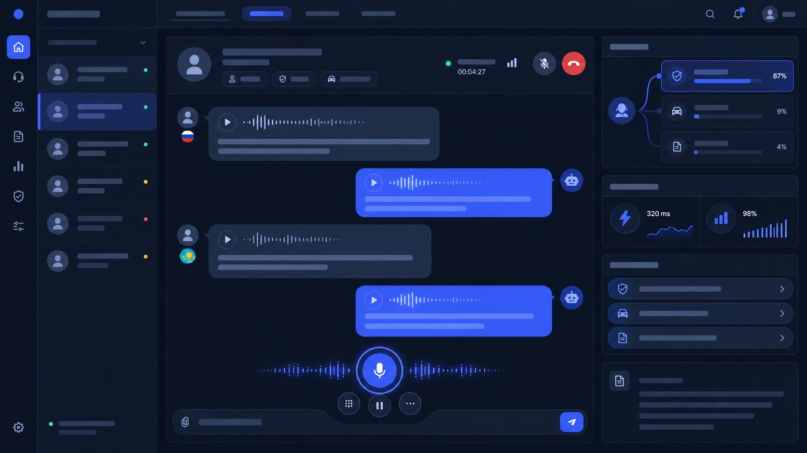
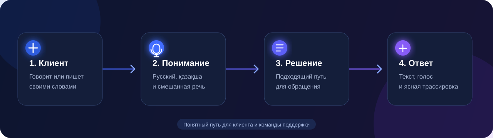

# AI Helpdesk

<p align="center">
  <strong>Голосовой AI-ассистент для современного контакт-центра</strong><br>
  Помогает клиенту быстро решить вопрос, а супервизору — видеть весь путь диалога.
</p>

<p align="center">
  <a href="#что-умеет">Возможности</a> ·
  <a href="#как-пользоваться">Как пользоваться</a> ·
  <a href="#быстрый-старт">Запуск</a>
</p>


<p align="center">
  <sub>Голос · Текст · Русский · Қазақша · Контроль качества</sub>
</p>

## Один разговор — понятный результат

**AI Helpdesk** — рабочее пространство для клиентской поддержки. Клиент может говорить или писать так, как ему удобно; ассистент понимает русскую речь, казахскую речь и естественное переключение между ними. Он отвечает на языке, которым завершён запрос, и помогает не потерять контекст, когда тема меняется прямо во время разговора.

Для команды поддержки это не просто чат: в интерфейсе остаётся прозрачная история обращения, выбранный путь решения и показатели качества каждого ответа.

## Интерфейс



## Что умеет

| | Возможность | Польза |
| :--: | --- | --- |
| 🎙️ | Голосовой и текстовый диалог | Клиент выбирает привычный способ обращения. |
| 🌐 | Русский, қазақша и смешанная речь | Не нужно переключать язык интерфейса перед разговором. |
| ↪️ | Переключение темы в диалоге | Новый вопрос обрабатывается без потери предыдущего контекста. |
| 🔊 | Ответ голосом | Диалог ощущается естественно и не заставляет читать длинные сообщения. |
| ✦ | Трассировка обращения | Супервизор видит, какое решение выбрано, почему и за какое время. |
| 📈 | Аналитика качества | Можно оценить скорость ответа, полезность и проблемные диалоги. |

## Как это работает для клиента



1. Откройте AI Helpdesk и войдите в свой аккаунт.
2. Нажмите кнопку микрофона и разрешите доступ к нему — или просто напишите вопрос в поле ввода.
3. Говорите естественно, на русском, қазақша или смешивая языки. Например: «Кеше төледім, бірақ тапсырыс расталмады».
4. Ассистент сразу покажет ответ и озвучит его. Если вопрос меняется, продолжайте тот же разговор — новый диалог создавать не требуется.
5. Оцените ответ кнопкой «Да» или «Нет». Это помогает команде замечать сложные обращения.

## Для супервизора

Откройте раздел **«Трассировка диалога»**, чтобы увидеть транскрипт, выбранный маршрут, уровень уверенности, альтернативные варианты и задержку на каждом этапе. В разделе **«Аналитика»** собраны показатели по диалогам: скорость, оценки клиентов и доля решённых обращений.

## Быстрый старт

### 1. Подготовьте настройки

Создайте `.env` из шаблона и добавьте свой ключ OpenAI:

```powershell
Copy-Item .env.example .env
```

Откройте `.env` и укажите:

```env
OPENAI_API_KEY=your_openai_api_key_here
OPENAI_MODEL=gpt-4o-mini
```

> Никогда не публикуйте `.env` и настоящий ключ в GitHub.

### 2. Запустите через Docker

```powershell
docker compose up --build
```

Откройте [http://localhost:8000](http://localhost:8000).

### Или запустите локально

```powershell
python -m venv venv
.\venv\Scripts\Activate.ps1
pip install -r requirements.txt
Copy-Item .env.example .env
uvicorn backend.main:app --reload
```

После запуска приложение будет доступно по адресу [http://localhost:8000](http://localhost:8000).

## Первые 60 секунд

1. Зарегистрируйте профиль на стартовом экране.
2. Нажмите **«Новый диалог»**.
3. Спросите голосом или текстом: «Как поменять адрес доставки?»
4. Послушайте ответ, затем откройте **«Трассировка диалога»** и посмотрите путь обращения.

## Конфиденциальность

Ключ доступа хранится только в локальном файле `.env`, который исключён из Git. История разговоров привязана к аккаунту пользователя. Перед публикацией проекта обязательно убедитесь, что `.env` не попал в коммит.

## Лицензия

Проект распространяется по лицензии [MIT](LICENSE).
